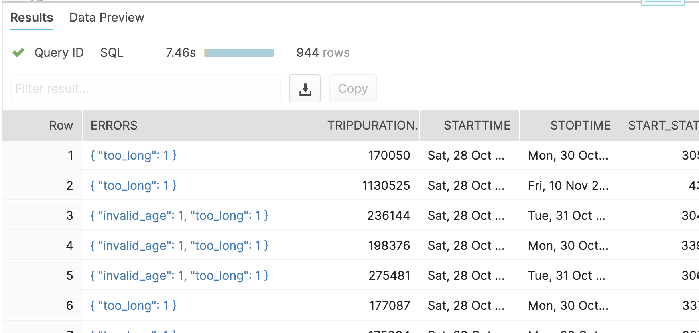

# snow-data-validation
Template for bespoke data validation using stored procedures and ANSI SQL on Snowflake

## Overview
Snowflake customers use a variety of tools as part of a larger solution to build enterprise grade, integrated systems that are automated and provide value to the business. Snowflake partners like Informatica, Matillion, dbt, Talend and Qlik provide data quality and data validation components as part of their tools. In many cases these companies have built in quality rules that check for data types, null values, proper encoding and other generic data rules that can be applied for multiple customers without prior knowledge of the data points. These powerful tools can be further customized for business specific data rules for bespoke validation of all data providing 100% validation coverage for data loaded into Snowflake. These tools are becoming cheaper and more powerful as time passes, but that doesn't always mean they are easy to deploy, manager, or easy to procure. Some organizations still have a litany of compliance factors that stand in the way even after other details have been worked out. Therefore, it's not always feasible to tools from the partner ecosystem especially if Snowflake can be leveraged to solve this problem.

To help Snowflake customers think about best practices for how they might implement a solution sans tools, we have developed a couple of examples that might help with developing or modifying these options for your own data warehouse. The Snowflake Professional Services team and Systems Integrators can assist with or implement processes like these. But it is worth noting that code provided as a template or as an example can assist customers in thinking through the process of implementing this pipeline or developing a strategy to support this. In traditional architectures, the limitations of compute and storage has forced focus of resources on the management of these resources; with Snowflake these responsibilities disappear and allow business to focus on devliering results with the data.

## Methods
The following methods used to validate data have their own unique advantages and disadvantages. Consider these as examples for building your own pipelines are relevant to your own data assets.

In both of the following methods, data comes from an external source. There are three distinct routes to load data into Snowflake. One route is to be  Extracted and Loaded through an ETL/ELT tool or custom application (e.g. python) and delivered to a staging table in Snowflake. Alternatively, data is loaded into a customer managed blob store (i.e. AWS S3, Azure Blob/ADLSG2, or GCP GCS) where Snowflake can be granted direct access to the relative location through an [External Stage](https://docs.snowflake.com/en/user-guide/data-load-bulk.html). Similarly, SnowSQL or the WebUI (with a compressed 50MB limitation for hte UI) can be used to bulk load data from an on-prem data source to a stage table. In any of those cases the primary objective is to load data into a "staging" or "landing" table in Snowflake. This table will collect all the data that is loaded into Snowflake.

The [VALIDATE](https://docs.snowflake.com/en/sql-reference/functions/validate.html) function can validate record level failures of past COPY commands. By default the COPY command will pass/fail a file that is loaded, but if the desire is to know which records have failed initial data loads then VALIDATE will be a good first stop towards

An [External Table](https://docs.snowflake.com/en/user-guide/tables-external-intro.html) can be leveraged to preemptively access the data in a customer managed blob store where views and queries can validate the data before an attempted data load.

Once this strategy is defined for the business for a data load process then additional business specific data rules can then be applied. Again this would be a great place for additional tooling to come into play, but if our goal is to simplify the architecture footprint or there are constraints with procuring additional tools then consider the following methods as examples for moving forward.

### Method 1 - Dynamic Common Table Expression (CTE) from Business Rules
Method 1 describes a stored procedure which is used to generate a Common Table Expression (CTE) for each of the business rules that are defined in the Validation Rules table. First a table is loaded with metadata about the Business Rule and the associated WHERE clause that will allow for the process to determine which rules fall outside the bounds defined by the rules. In the example provided we use Citibike Trips data that are leveraged as part of our online [Zero to Snowflake labs](https://s3.amazonaws.com/snowflake-workshop-lab/InpersonZTS_LabGuide.pdf). The data can be connected to via an External Stage to this S3 bucket URL [(s3://snowflake-workshop-lab/citibike-trips)](s3://snowflake-workshop-lab/citibike-trips).

The example business rules that we will conduct are:
* bike rides cannot exceed 24 hours
* Riders cannot be older than 150 years old
* The starttime must be a valid date and time

The first step will to be to generate a table to hold all of our business rules found [here](Method1/validation_rules.sql). We write criteria against the base table that will be applied to the WHERE clause in the CTE. Second, the [Data Validation](Method1/validation_proc.sql) stored procedure(SP) will read the business rules tables. For each base table, the SP gathers the rule collection and for each rule a CTE is created. The CTEs are joined back to the base table with a Primary Key. The stored procedure has an optional PK field which will help for more efficient joins back to the base table, but if a PK does not exist then the procedure will generate an MD5 hash based on the data in a row for the purposes of the join.

-table

--rule

The net result of the procedure is an error column dynamically generated with data points for each observation/row and its associated error column. We leverage the unique capability of Snowflake to build our Error Results dynamically with a JSON object. This allows us to store the fluctuating number of rules tied directly to the row itself. This means as validation rules are added or removed (deprecated) the table definition doesn't need to change!

**Pros**
All business rules are kept in a single table repository. This centralizes all the rules and makes them easy to manage. Rules can be deprecated through a start/end date allowing them to naturally expire or manual obsolescence.

**Cons**
Any time you create a dynamic process, the probability of error due to complications increases.

### Method 2 - Declarative Pipeline through concrete Views
Method 2 requires a series of views, each that run their own validation. The approach is very similar to Method 1, in that you will be creating a series of views that return errors based on your testing criteria. See the Method 1 documentation above for ideas for creating validation rules. Once you have the views established, you can connect each into a BI tool for reporting and alerting, or optionally combine all errors into one final view for one single source of all errors, which can also be aggregated for reporting and alerting as well.

The folder `Method2` walks through an example of setting up your views with two options for the final view of all errors combined.

**Pros**
Complicated business rules can be defined in more robust SQL. Cross database checks, with joins and aggregation, can be leveraged to include other data domains or lookup tables.

**Cons**
This is not a dynamic process, with a Stored Procdure doing the work for you; you will be required to manually create and maintain each view individually.  The views, if not well managed, can create sprawl that makes the views difficult to understand or manage from a broader perspective; for example, if you have 100 tests, you would have 100 individual views, rather than just 100 individual rows you'd create for Method 1.

### Method 3 - External Tables

**Pros**
Validates data from blob storage without moving into Snowflake. Benefits pre-validating the data before moving it into Snowflake allowing for remediation closer to the source.

**Cons**
Some latency as a result of the data being outside of Snowflake.

## Example Data and Rules

Snowflake demos have been oriented around Citibike data that is provided publicly on their [website](https://www.citibikenyc.com/system-data). Citibike is a bike shareing program in New York. The data that is provided from them is real, de-identified observations of bike rides in NY. Snowflake provides a copy of this data for labs that can be accessed here
[(s3://snowflake-workshop-lab/citibike-trips)](s3://snowflake-workshop-lab/citibike-trips). This will be the data used as an example for this template.

Example Data:

  |TRIPDURATION|STARTTIME|STOPTIME|START_STATION_ID|START_STATION_NAME|START_STATION_LATITUDE|START_STATION_LONGITUDE|END_STATION_ID|END_STATION_NAME|END_STATION_LATITUDE|END_STATION_LONGITUDE|BIKEID|MEMBERSHIP_TYPE|USERTYPE|BIRTH_YEAR|GENDER|
 |---|---|---|---|---|---|---|---|---|---|---|---|---|---|---|---|
 |1695|2013-06-09 15:07:05.000|2013-06-09 15:35:20.000|328|Watts St & Greenwich St|40.72405549|-74.00965965|195|Liberty St & Broadway|40.70905623|-74.01043382|17652||Customer||0|
 |1469|2013-06-09 15:07:05.000|2013-06-09 15:31:34.000|417|Barclay St & Church St|40.71291224|-74.01020234|232|Cadman Plaza E & Tillary St|40.69597683|-73.99014892|15785||Customer||0|
 |1855|2013-06-09 15:07:06.000|2013-06-09 15:38:01.000|306|Cliff St & Fulton St|40.70823502|-74.00530063|309|Murray St & West St|40.7149787|-74.013012|15168||Subscriber|1971|1|

The example business rules that we will conduct are:
* bike rides cannot exceed 24 hours
* Riders cannot be older than 150 years old
* The starttime must be a valid date and time

This will translate into the following criteria in ANSI SQL:
* tripduration > (60*60*24)
* date_from_parts(birth_year,month(current_Date()),day(current_date())) < dateadd(year,-150,current_date())
* IFF(TRY_TO_DATE(STARTTIME::VARCHAR) IS NOT NULL,FALSE,TRUE)

In the first rule the tripduration is recorded in seconds, so we multiple 60 seconds by 60 minutes by 24 hours to result in 1 day. I assumed that a bike ride would not lapse 24 hours, but upon inspection of the example data by running this rule we find that there are several observations that are

In the second rule we are provided the birth year, so we generate a date from this using the DATE_FROM_PARTS functions and compare it to today's date - 150 years.

In the final rule we simply attempt to convert a timestamp to a date to verify that it is valid.

## Error Reporting with SnowSight

Snowsight is Snowflake's dashboarding tool for tracking metrics at scale. We can use it to create a dashboard that monitors the health of the data validation process that we've created.

## Maintainers

**Gabriel Mullen**
is a Senior Sales Engineer with Snowflake for the State, Local, and Education Team

**Brock Cooper**
is a Senior Sales Engineer with Snowflake for the State, Local, and Education Team

This is a community-developed script, not an official Snowflake offering. It comes with no support or warranty. However, feel free to raise a github issue if you find a bug or would like a new feature.

## Legal
Licensed under the Apache License, Version 2.0 (the "License"); you may not use this tool except in compliance with the License. You may obtain a copy of the License at: http://www.apache.org/licenses/LICENSE-2.0

Unless required by applicable law or agreed to in writing, software distributed under the License is distributed on an "AS IS" BASIS, WITHOUT WARRANTIES OR CONDITIONS OF ANY KIND, either express or implied. See the License for the specific language governing permissions and limitations under the License.
